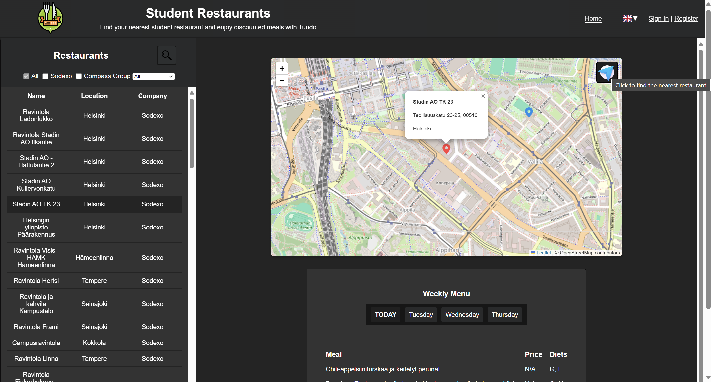

# WSD_Individual_Assignment

Frontend of the individual project from WSK25-Web-Dev course (Metropolia Ohjelmistotuotanto).

Project is accessible from [this link](https://users.metropolia.fi/~tonykar/WSD_Individual_Assignment/). To make use of all of the functionalities, make sure that the backend is up and running.

Backend server is accessible at [https://10.120.32.74/web-page/](https://10.120.32.74/web-page/).

For more information about the [backend](https://github.com/TonyKarlin/WSD_Individual_Assignment_Backend).

### Features

- User registration and login.
- Modifying user data.
- Filtering restaurants
- Finding the nearest restaurant to you.
- Searching for weekly menu of the restaurants.
- Dynamic content rendering using JavaScript.
- Integration with external APIs for real-time data.
- User-friendly navigation and interface.
- Form validation and error handling.
- Deployed on a public server for easy access.

### Screenshot of the web page

